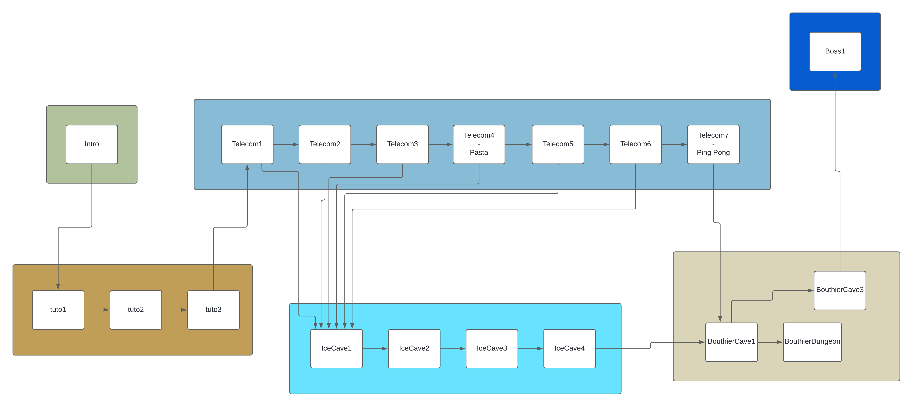

# Bâtô & Ver2Ter
*Ou bien Paquebots & Lombrics*

## Présentation

Pakbo é Lombrik est un jeu qui se veut dynamique, avec des combats amusants et du platforming qui donne envie d'explorer un monde qui tourne autour de TN mais pas que !




## Installation

**Section destinée aux développeurs**

### Linux

Setup de SDL2 (sous Linux avec `apt`) & Jansson (librairie pour parse du JSON) :

```sh
sudo apt-get install libsdl2-dev libsdl2-image-dev libsdl2-ttf-dev libsdl2-mixer-dev libjansson-dev
```

Setup de SDL2 (sous Arch avec `yay`) :

```sh
yay -S sdl2 sdl2_image sdl2_mixer sdl2_ttf
```

### Mac OSX

Setup de SDL2 (sous Mac OSX avec `brew`) :

```sh
brew install sdl2 sdl2_image sdl2_ttf sdl2_mixer sdl2_ttf
```

Voilà c'est tout. 


## Structure du projet :

```
- src/ : Contient les fichiers sources
	| - main.c : Fichier principal qui lance le jeu et gère la main loop
	| - scenes/ : Continedra ce qu'il faut pour chaque zone/biome
		| - exemple_scene/
			| - exemple_scene.json : suit un format particulier pour décrire un niveau
			| - exemple_scene.h/c : pour la logique du niveau
	| - entities/ : Contiendra ce qu'il faut pour chaque entité
		| - exemple_monster/
			| - exemple_monster.h/c : pour la logique du mob
	| - weapons/ :
		| - exemple_weapon/
				| - exemple_weapon.h/c : pour la logique de l'arme
	| - engine/ : Contient les fichiers du moteur de jeu
		| - include/ : tous les .h (+ facile pour la compilation)
		| - structures/ : structure de données utiles (hashtable, linked lists...)
		| - fichiers .c utiles pour le game engine
	| - assets/ : Contient les fichiers images et autres utiles
		| - audio/
		| - sprites/
		| ...
- Makefile : Pour construire le jeu (selon architecture)
```

## Level Editor 
Editeur de niveau Bâto & Ver2Ter
> ou Paquebots & Lombrics


### Installation 

Tout est dans le fichier ```PL_LevelEditor_11.dmg```. Il se trouve dans [```P-L-level-editor/versions/1.1```](https://github.com/moise7000/P-L-level-editor/tree/main/versions/1.1)


### Gestion des Assets
Dans le projet ```C```, on a l'architecture de fichiers suivante :

```
|--src
    |-assets
        |-entities
        |-structures
        |-backgrounds
        |-entitiesForEditor : Contient une seule frame par sprite. Cette frame sera affichée dans l'éditeur
        
```
        
        
La gestion des assets de l'éditeur repose sur l'architecture du projet ```C``` . En effet l'éditeur vous demande de selectionner un dossier supposé contenir tous les assets du jeu. Il alors regarde tous les fichiers qui se trouvent dans ce dossier. Il est donc essentiel de selectionner le dossier ```src/```

En ce qui concerne l'ajout d'asset il faut procéder de la manière suivante :  
- Le nom de votre fichier png doit être écrit en camelCase : ```nomDeMonImage.png```. Cela est nécessaire pour la génération du fichier JSON. (Si vous ne respectez pas ce point c'est à vous risques et périls)
- Pour l'ajout de structures, respectivement de backgrounds, vous devez ajoutez votre fichier PNG dans ```src/assets/structures```, respectivement ```src/assets/backgrounds```.
- Pour l'ajout d'entities vous devez ajouter votre fichier PNG (une frame unique qui sera utiliser dans l'éditeur) dans le dossier ```src/assets/entitiesForEditor``` puis votre spritesheet dans le dossier ```src/assets/entities```. Notez que la frame unique et le spritesheet doivent porter le même nom. 
 


